#                                   Mysql数据库


# ==基础：==

# Mysql概述


## 数据库相关概念


- 数据库：数据存储的仓库
- 数据库管理系统：操纵和管理数据库的大型软件
- SQL：操作关系型数据库的编程语言，是一套标准


## 数据模型

- 关系型数据库（RDBMS）


# SQL

## 通用语法及分类

- SQL通用语法


- SQL分类


## DDL

### 数据库操作


### 表操作

- 查询


- 创建


示例：


```sql
mysql> create table tb_user(
    -> id int comment '编号',
    -> name varchar(50) comment '姓名',
    -> age int comment '年龄',
    -> gender varchar(1) comment '性别'
    -> ) comment '用户表' ;
```


- 数据类型及案例


- 修改

1. 添加


2. 修改


3. 删除


4. 修改表名


5. 删除表


### DDL小结


## DML

- 介绍


### 添加数据


```sql
insert into tb_user(id, name, age, gender) values (1,'itcast',10,'男');

select * from tb_user;

insert into tb_user values (2,'itcast2',20,'女');

insert into tb_user values (3,'itcast3',9,'男'),(4,'itcast4',6,'女');
```


### 更新和删除数据

- 更新


```sql
update  tb_user set name='itheima' where id=1;

update tb_user set name='小昭',gender='女' where id=1;

update  tb_user set gender='女';
```


- 删除


```sql
delete from tb_user where id=1;

delete from tb_user;
```


### 总结


## DQL

- 介绍


### 基础查询

- 语法


- 基本查询


```sql
create table emp(
    id int comment '编号',
    workno varchar(10) comment '工号',
    name varchar(10) comment  '姓名',
    gender char(1) comment  '性别',
    age tinyint comment '年龄',
    idcard char(18) comment '身份证号',
    workaddress varchar(50) comment '工作地址',
    entrydate date comment '入职时间'
) comment '员工表';

insert into emp(id, workno, name, gender, age, idcard, workaddress, entrydate)
values (1,'1','柳岩','女',20,'123456789789456123','北京','2000-01-01'),
       (2,'2','张无忌','男',21,'123456789789456523','上海','2000-02-01'),
       (3,'3','韦一笑','男',22,'123456789789756123','江苏','2000-03-01'),
       (4,'4','赵敏','女',23,'123456789789456126','成都','2000-04-01'),
       (5,'5','小昭','女',24,'123456789789456121','天津','2000-05-01'),
       (6,'6','张三丰','男',25,NULL,'广州','2000-06-01');

-- 查询指定字段 name,workno,age返回
select name,workno,age from emp;

-- 查询所有字段返回
select id, workno, name, gender, age, idcard, workaddress, entrydate from emp;

select * from emp;

-- 查询所有员工地址

select emp.workaddress as '工作地址' from emp ;

-- 查询员工的工作地址（不要重复）
select distinct  emp.workaddress '工作地址' from emp;

```


### 条件查询

- 语法


```sql

-- 条件查询
-- 1.查询年龄=23的员工
select * from emp where age=23;

-- 2.查询年龄小于23的员工信息
select * from emp where age<23;

-- 3.查询年龄小于等于23的员工
select * from emp where age<=23;

-- 4.查询没有身份证号的成员信息
select * from emp where idcard is null;

-- 5.查询有身份证号的员工信息
select * from emp where idcard is not null;

-- 6.查询年龄不等于23的成员信息
select * from emp where age!=23;

-- 7.查询年龄在21到24之间的员工信息
select * from emp where 21<=age && age<=24;

-- 8.查询性别为女且年龄小于23的员工信息
select * from emp where gender='女' and age<23;

-- 9.查询年龄等于21，22，24的员工信息
select * from emp where  age=21 or age=22 or age=24;

-- 10.查询性别为2个字的员工
select * from emp where name like '__';

-- 11.查询身份证最后一位是X的员工信息
select * from emp where idcard like '%X';
```


### 聚合函数

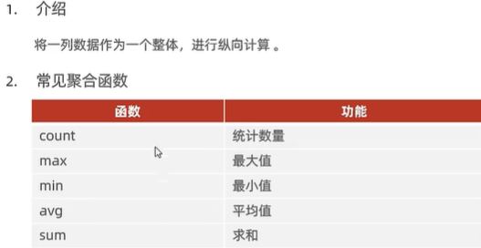


- 语法

select 聚合函数（字段列表） from 表名;

**null值不参与运算**


```sql

-- 聚合函数
-- 1.统计该企业员工数量
select count(*)  from emp;
select count(id) from emp;

-- 2.统计员工的平均年龄
select avg(age) from emp;

-- 3.统计最大年龄
select max(age) from emp;

-- 4.统计最小年龄
select min(age) from emp;

-- 5.统计北京地址年龄之和
select sum(age ) from emp where workaddress='北京';
```


### 分组查询

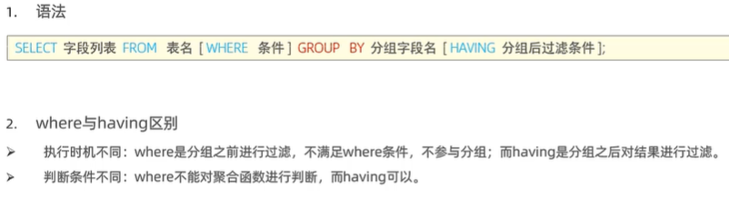


```sql
-- 分组查询
-- 1.根据性别分组，统计男性员工和女性员工数量
select gender,count(*) from emp group by gender ;

-- 2.根据性别分组，统计男性员工和女性员工的平均年龄
select gender,avg(age) from emp group by  gender;

-- 3.查询年龄小于45的员工，并根据工作地址分组，获取数量大于等于3的工作地址
select workaddress,count(*) from emp where age<45 group by  workaddress having  count(*) >=3;
```

- 注意
- 


### 排序查询

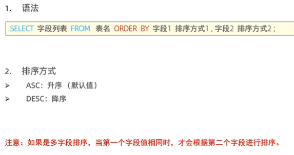

```sql
-- 排序查询
-- 1.根据年龄对公司的员工进行升序排序
select * from emp order by age asc;

-- 2.根据入职时间降序排序
select * from emp order by entrydate desc ;

-- 3.根据年龄对公司的员工进行升序排序，年龄相同，再按照入职顺序降序排序
select * from emp order by age asc ,entrydate desc;
```


### 分页查询

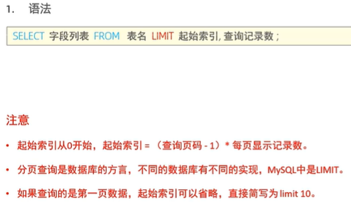

```sql
-- 分页查询
-- 1.查询第一页员工数据，每页展示3条记录
select * from emp limit 0,3;

-- 2.查询第二页数据，每页3条记录
select * from emp limit 3,3;
```


### 案例练习

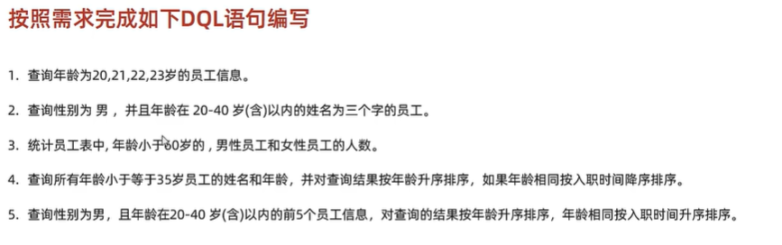

```sql
-- 1
select * from emp where gender='女'  and age in(20,21,22,23);

-- 2
select * from emp where gender='男' and  (age between  20 and 40) and name like '___';

-- 3
select gender,count(*) from emp where age<60 group by  gender ;

-- 4
select name,age  from emp where age<=35 order by age asc,entrydate desc ;

-- 5
select * from emp where gender='男'  and age between  20 and 40  order by age  asc, emp.entrydate limit 5;
```


### DQL执行顺序

 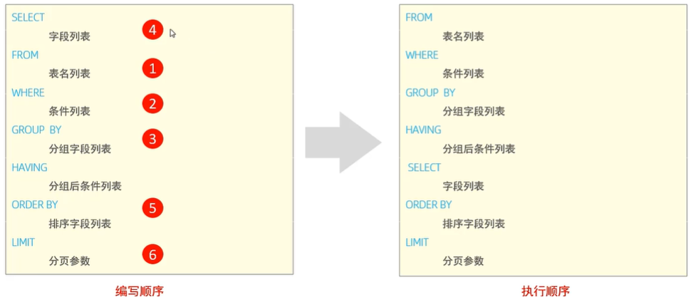


### 总结

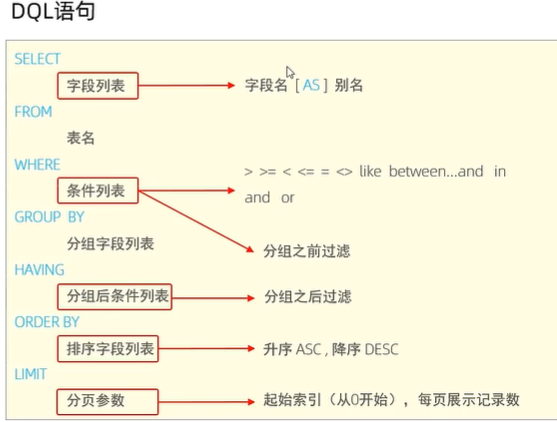


## DCL

- 介绍

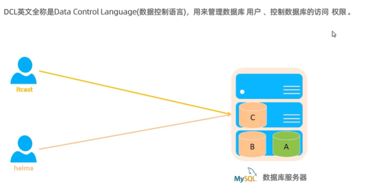


### 用户管理


```sql
-- 创建用户itcast,只能够在当前主机localhost访问，，密码123456
create user 'itcast'@'localhost' identified  by '123456';

-- 创建用户heima，可以在任意主机访问该数据库，密码123456
create user 'heima'@'%' identified  by '123456';

-- 修改用户heima的访问密码为1234；
alter user 'heima'@'%' identified with mysql_native_password by '1234';

-- 删除itcast@localhost用户
drop user 'itcast'@'localhost';
```


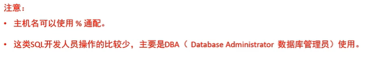


### 权限控制

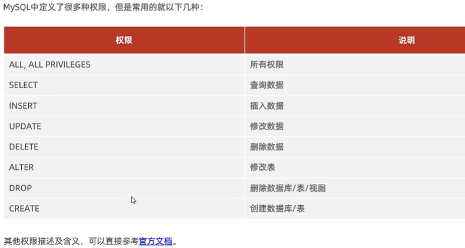

- 操作


```sql
-- 查询权限
show grants for 'heima'@'%';

-- 授予权限
grant  all on itcast.* to 'heima'@'%';

-- 撤销权限
revoke all on itcast.* from 'heima'@'%';
```


### 小结

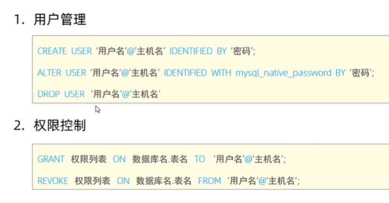


# 函数

## 介绍

- 函数：是指一段可以直接被另一段程序调用的程序或代码


## 字符串函数

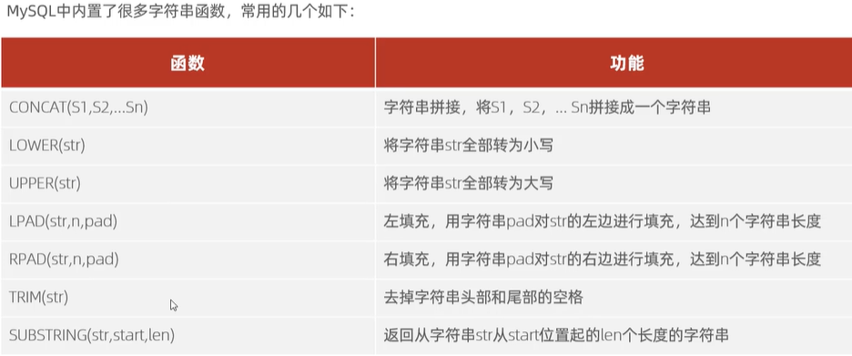

```sql
-- ---------函数演示------------------
-- concat
select concat('hello ','mysql');

-- lower
select lower('Hello');

-- upper
    select upper('Hello');

-- lpad
    select lpad('01',5,'0');

-- rpad
    select rpad('01',5,'0');

-- trim
    select trim(' Hello Mysql ');

-- substring
    select substring('Hello Mysql',1,5);
```


- 案例

```sql
-- 1.企业员工的工号，统一为5位数，不足5位数全部在前面补0；
update emp set workno=lpad(workno,5,'0');
```


## 数值函数

- 常见数值函数

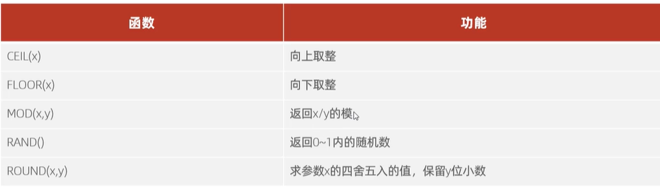

```sql
-- 数值函数
-- ceil
select ceil(1.1);

-- floor
select floor(1.2);

-- mod
select mod(3,4);

-- rand
select rand();

-- round
select round(2.3759346,5);
```

- 案例

```sql
-- 2.通过数据库函数，生成一个六位数的随机验证码
select lpad(round(rand()*1000000,0),6,'0');
```


## 日期函数

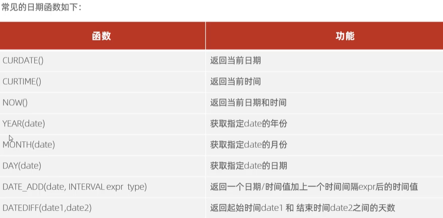

```sql

-- 日期函数
-- curdate
select curdate();

-- curtime
select curtime();

-- now
select now();

-- year,month,day
select year(now());
select month(now());
select day (now());

-- date_add
select date_add(now(),INTERVAL 70 DAY);
select date_add(now(),INTERVAL 70 month);

-- datediff
select datediff('2021-12-1','2021-11-1');
```


- 案例

```sql
-- 3.查询所有员工的入职天数，并根据入职天数倒序排序
select name,datediff(curdate(),entrydate) as 'entrydays' from emp order by entrydays desc ;
```


## 流程函数

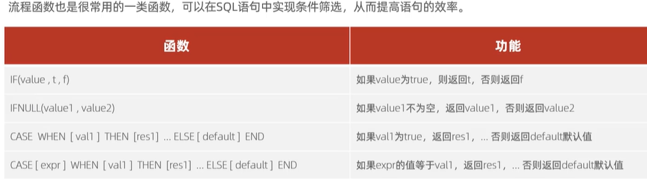

```sql
-- 流程控制函数
-- if
select if(true,'ok','error');

-- ifnull
select ifnull('ok','default');
select ifnull(null,'default');

-- case when then else end
-- 需求：查询emp表的员工姓名和工作地址（北京/上海--->一线，其它-->二线）
select
    name,
    (case workaddress when'北京' then '一线城市' when '上海' then '一线城市' else '二线城市' end) as '工作地址'
from emp;
```

- 案例

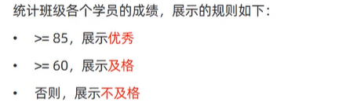

```sql
create table score(
    id int comment 'ID',
    name varchar(20) comment '姓名',
    math int comment '数学',
    english int comment '英语',
    chinese int comment '语文'
) comment '学员成绩表';
insert into score (id,name,math,english,chinese)
values (1,'Tom',67,88,95),(2,'reose',23,66,90),
       (3,'Jack',56,98,76);

select
    id,
    name,
    case  when math>=85 then '优秀' when math >=60 then '及格' else '不及格' end,
    case  when english>=85 then '优秀' when english >=60 then '及格' else '不及格' end,
    case  when chinese>=85 then '优秀' when chinese >=60 then '及格' else '不及格' end
from score;
```


## 小结

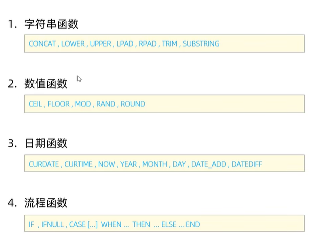


# 约束

## 概述

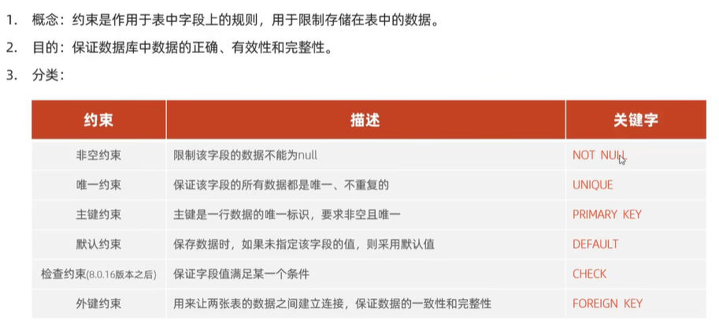

- 注意：约束是作用于表中字段上的，可以在创建表/修改表时添加约束


## 约束演示

- 案例

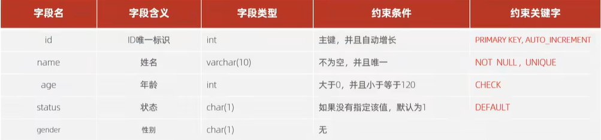

```sql
-- ---------------约束演示-------------------

create table user(
    id int primary key auto_increment comment '主键',
    name varchar(10) not null unique comment '姓名',
    age int check(age>0 and age<=120) comment '年龄',
    status char(1) default  '1' comment '状态',
    gender char(1) comment '性别'
) comment '用户表';

-- 插入数据
insert into user(name, age, status, gender) values('Tom1',19,'1','男'),('Tom2',20,'0','男');
insert into user(name, age, status, gender) values('Tom3',19,'1','男');

-- 非法 insert into user(name, age, status, gender) values(null,19,'1','男');
-- 非法 insert into user(name, age, status, gender) values('Tom3',19,'1','男');

insert into user(name, age, status, gender) values('Tom4',80,'1','男');
--  非法  insert into user(name, age, status, gender) values('Tom5',-1,'1','男');

insert into user(name, age, gender) values('Tom5',120,'男');
```


## 外键约束

- 概念

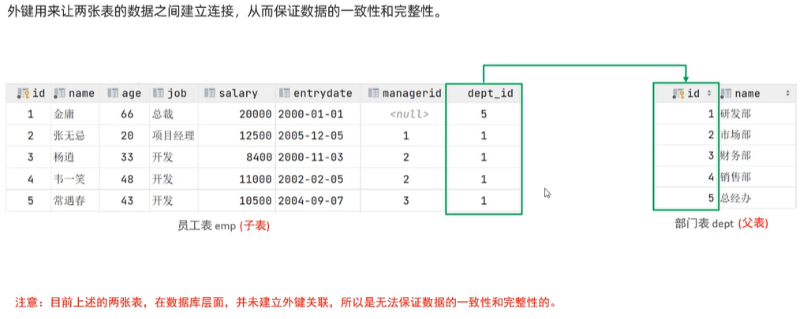


- 语法

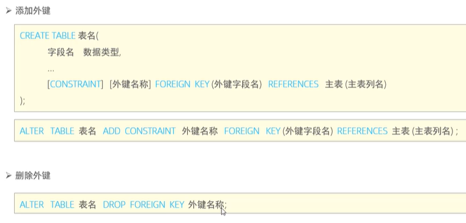

```sql
create table dept(
    id int auto_increment comment 'ID' primary key ,
    name varchar(50) not null comment '部门名称'
)comment  '部门表';
insert into dept(id,name) values (1,'研发部'),(2,'市场部'),(3,'财务部'),(4,'销售部'),(5,'总经办');

create table emp(
    id int auto_increment comment 'ID' primary key ,
    name varchar(50) not null comment '姓名',
    age int comment '年龄',
    job varchar(20) comment '职位',
    salary int comment '薪资',
    entrydate date comment '入职时间',
    manager int comment '直属领导ID',
    dept_id int comment '部门ID'
) comment '员工表';

insert into emp (id, name, age,job, salary, entrydate, manager, dept_id) values
          (1, '金庸', 66, '总裁', 20000, '2000-01-01', null, 5),
          (2, '张无忌', 20, '项目经理', 12500, '2005-12-05', 1, 1),
          (3, '杨逍', 33, '开发', 8400, '2000-11-03', 2, 1),
          (4, '韦一笑', 48, '开发', 11000, '2002-02-05', 2, 1),
          (5, '常遇春', 43, '开发', 10500, '2004-09-07', 3, 1),
          (6, '小昭', 19, '程序员鼓励师', 6600, '2004-10-12', 2, 1);


-- 添加外键
alter table  emp add constraint fk_emp_dept_id foreign key (dept_id) references dept(id);

-- 删除外键
alter table emp drop foreign key  fk_emp_dept_id;
```


## 外键删除更新行为

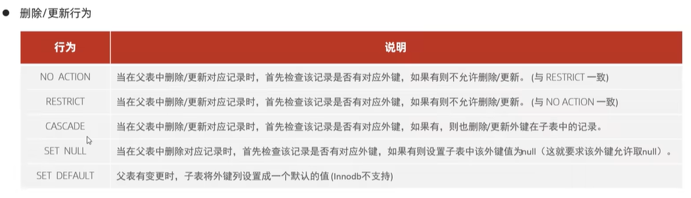


```sql
alter table  emp add constraint fk_emp_dept_id foreign key (dept_id) references dept(id) on update cascade  on delete  cascade ;

alter table  emp add constraint fk_emp_dept_id foreign key (dept_id) references dept(id) on update set null   on delete  set null ;
```


## 小结


# 多表查询

## 多表关系

- 一对多

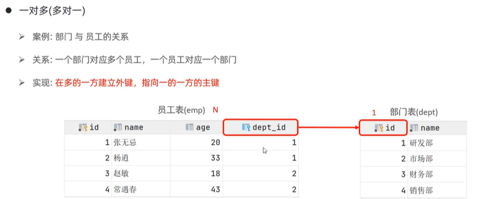

- 多对多

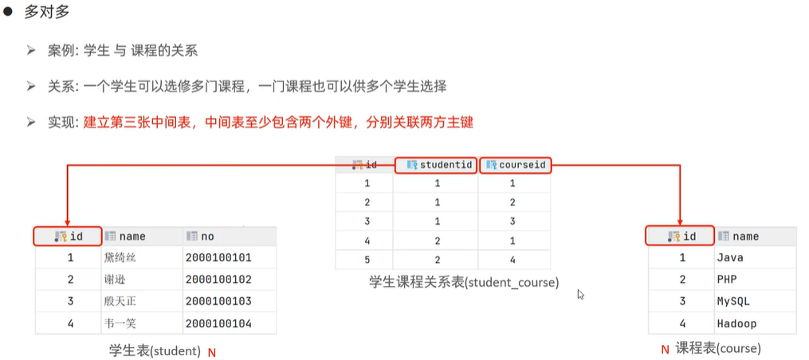

- 一对一

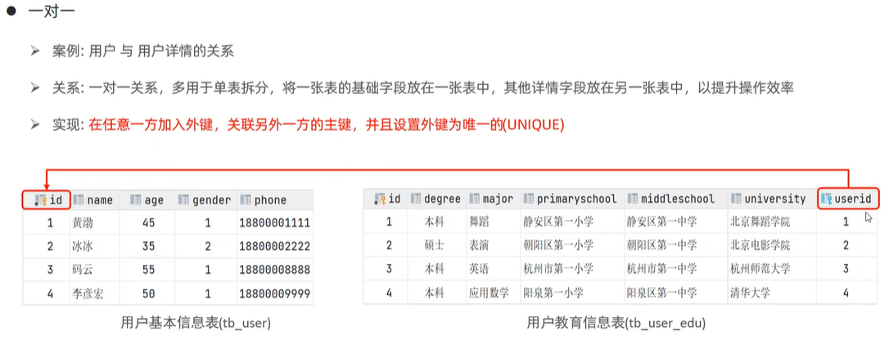

```sql
-- 多对多
 create table student(
     id int auto_increment primary key  comment '主键ID',
     name varchar(10) comment '姓名',
     no varchar(10) comment '学号'
 ) comment '学生表';

insert into student values (null,'黛绮丝','2000100101'),
                           (null,'谢逊','2000100102'),
                           (null,'殷天正','2000100103'),
                           (null,'韦一笑','2000100104');


create table course(
    id int auto_increment primary key  comment '主键ID',
    name varchar(10) comment '课程名称'
) comment '课程表';
insert into  course values (null,'Java'),(null,'OHP'),(null,'Mysql'),(null,'Hadoop');

create table student_course(
    id int auto_increment comment '主键' primary key ,
    studentid int not null comment '学生ID',
    courseid int not null comment '课程ID',
    constraint fk_courseid foreign key (courseid) references course(id),
    constraint fk_studentid foreign key (studentid) references student(id)
) comment '学生课程中间表';

insert into student_course values (null,1,1),(null,1,2),(null,1,3),(null,2,2),(null,2,3),(null,3,4);


-- 一对一
create table  tb_user(
    id int auto_increment primary key  comment '主键ID',
    name varchar(10) comment '姓名',
    age int comment '年龄',
    gender char(1) comment '性别',
    phone char(11) comment '手机号'
) comment '用户基本信息表';


create table  tb_user_edu(
    id int auto_increment primary key  comment '主键ID',
    degree varchar(20) comment '学历',
    major varchar(50) comment '专业',
    primaryschool varchar(50) comment '小学',
    middleschool varchar(50) comment '中学',
    universchool varchar(50) comment '大学',
    userid int unique  comment '用户ID',
    constraint fk_userid foreign key (userid) references tb_user(id)
) comment '用户教育信息表';

insert into tb_user values
    (null,'黄渤',45,'1','18800001111'),
    (null,'冰冰',35,'2','18800002222'),
    (null,'马云',55,'1','18800008888'),
    (null,'李彦冰',59,'1','18800009999');

insert into tb_user_edu (id,degree, major, primaryschool, middleschool, universchool, userid) values
    (null,'本科','舞蹈','静安第一小学','静安第一中学','北京舞蹈学院','1'),
    (null,'硕士','朝阳第一小学','朝阳第一中学','北京电影学院','','2'),
    (null,'本科','英语','杭州第一小学','杭州第一中学' ,'杭州师范大学','3'),
    (null,'本科','应用数学','阳泉第一小学','阳泉第一中学','清华大学','4');


```


## 概述

 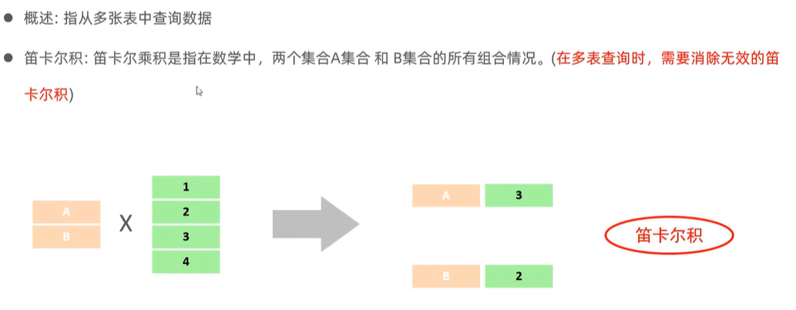

```sql
-- 多表查询
select * from emp,dept where emp.dept_id=dept.id;
```

- 分类

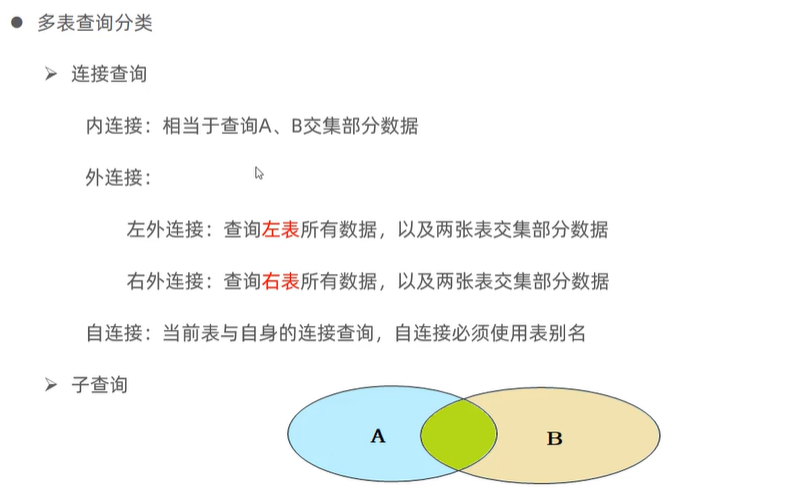


## 内连接查询

- 内连接查询语法

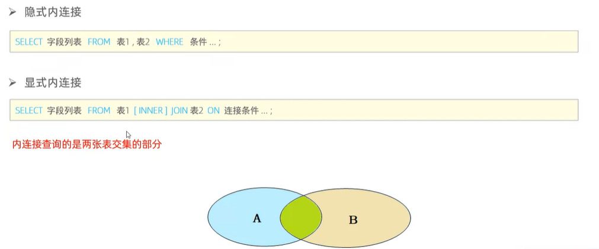

```sql
-- 内连接演示
-- 1.查询每一个员工的姓名，及关联的部门名称（隐式内连接实现）
-- 表结构：emp,dept
-- 连接条件:emp.dept_d=dept.id

select emp.name,dept.name from emp,dept where emp.dept_id=dept.id;

select e.name,d.name from emp e,dept d where e.dept_id=d.id;
-- 如果起了别名就不能使用原名


-- 2.查询每一个员工的姓名，及关联的部门名称（显式内连接实现）  .....[inner] join ...on...
-- 表结构：emp,dept
-- 连接条件:emp.dept_d=dept.id

select e.name,d.name from emp e inner join dept d on e.dept_id=d.id
```


## 外连接

- 外连接查询语法

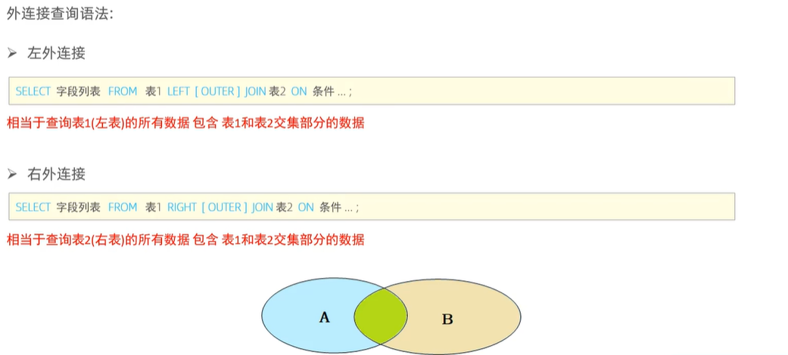

```sql
-- 外连接演示
-- 1.查询emp表的所有数据，和相对应的部门信息（左外连接）
-- 表结构：emp,dept
-- 连接条件:emp.dept_d=dept.id

select e.* ,d.name from emp e left outer join dept d on e.dept_id=d.id;


-- 1.查询emp表的所有数据，和相对应的部门信息（右外连接）
select e.* ,d.name from emp e right outer join dept d on e.dept_id=d.id;
```


## 自连接

- 语法


```sql
-- 自连接
-- 1.查询员工 及所属直接领导
-- 表结构：emp

select a.name,b.name from emp a,emp b where a.managerid=b.id;

-- 2. 查询所有员工emp及其领导的名字emp,如果员工没有领导，也需要查询出来
-- 表结构：emp a,emp b

select a.name '员工',b.anme '领导' from emp a left join emp b on a.managerid=b.id;
```


## 联合查询

- 语法


```sql
-- union all,union
-- 1.将年薪低于5000的员工和年龄大于50的员工
select * from emp where salary<5000
union all
select * from emp where age>50;

-- 去重
select * from emp where salary<5000
union 
select * from emp where age>50;


```


## 子查询

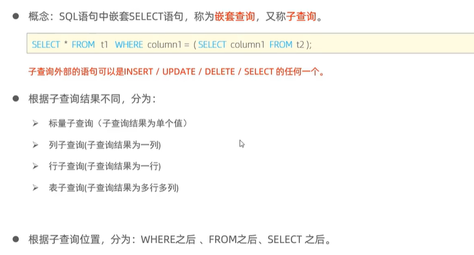


### 标量子查询


```sql
-- 标量子查询
-- 1.查询“销售部”的所有员工信息

-- a.查询“销售部”的ID
select id from dept where name='销售部';
-- b.根据销售部ID，查询员工信息
select * from emp where dept_id=(select id from dept where name='销售部');

-- 2.查询在“方东白”入职之后的信息
-- a.查询“方东白”的入职日期
select entrydata from emp where name='方东白';

-- b.查询入职之后的信息
select * from emp where entrydate >(select entrydata from emp where name='方东白');
```


### 列子查询


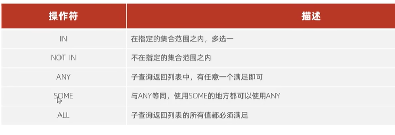

```sql
-- 列子查询
-- 1.查询销售部和市场部的所有员工信息
-- a.查询销售和市场部ID
select id from dept where name='销售部' or name='市场部';

-- b.根据ID，查询员工信息
select * from emp where dept_id in (select id from dept where name='销售部' or name='市场部');

-- 2.查询比财务部所有人工资都高的员工的信息
-- a.查询财务部员工工资
select id from dept where name='财务部';

selcet salary drom emp where dept_id=(select id from dept where name='财务部');

-- b.比财务部所有人工资都高的
select * from emp where salary>all(selcet salary drom emp where dept_id=(select id from dept where name='财务部'));

```


### 行子查询


```sql
-- 行子查询
-- 1. 查询与“张无忌”的薪资及直属领导相同的员工信息
-- a.查询“张无忌”的薪资及直属领导

select salary,managerid from emp where name='张无忌';

-- b.查询与“张无忌”的薪资及直属领导相同的员工信息
select * from emp where salary=12500 and managerid=1;

select * from emp where (salary,managerid)=(select salary,managerid from emp where name='张无忌');

```


### 表子查询


```sql
-- 表子查询
-- 1.查询与鹿仗客和宋远桥职位和薪资相同的员工信息
-- a. 查询鹿仗客和宋远桥职位和薪资
select jod,salary from emp where name='鹿仗客' or name='宋远桥';

-- b. 查询与鹿仗客和宋远桥职位和薪资相同的员工信息
select * from emp where {job,salary) in (select jod,salary from emp where name='鹿仗客' or name='宋远桥');

-- 2. 查询入职日期为“2006-01-01”之后的员工信息，及部门信息
-- a.入职日期为2006-01-01”之后的员工信息
select * from emp where entrydata >"2006-01-01";

--b.查询入职日期为“2006-01-01”之后的员工信息，及部门信息
select * from (select * from emp where entrydata >"2006-01-01") e left join dept d on e.dept_id=d.id;
```


## 案例

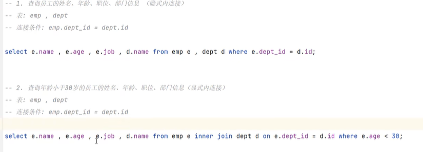

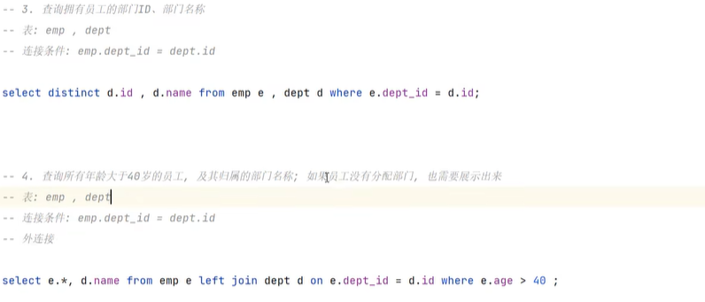

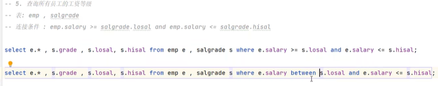


# 事务

