#                                   Mysql数据库


# ==基础：==

# Mysql概述


## 数据库相关概念

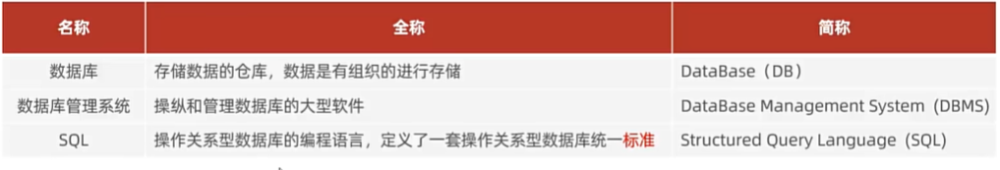

- 数据库：数据存储的仓库
- 数据库管理系统：操纵和管理数据库的大型软件
- SQL：操作关系型数据库的编程语言，是一套标准

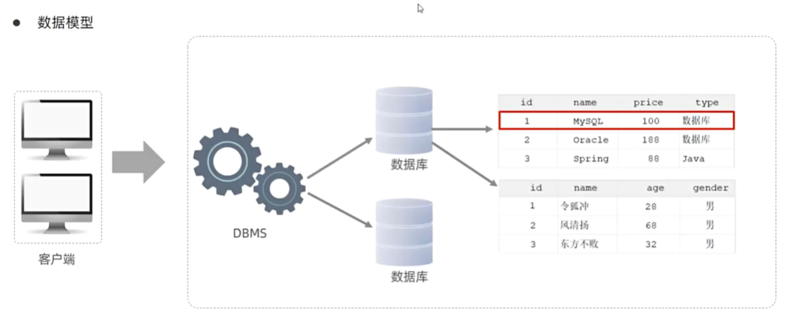


## 数据模型

- 关系型数据库（RDBMS）

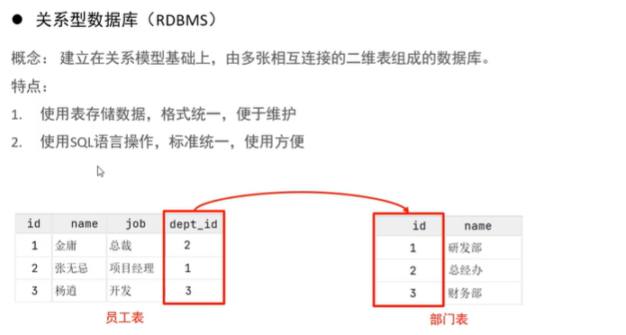

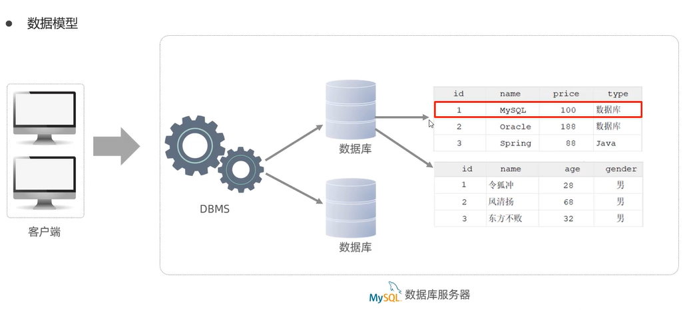


# SQL

## 通用语法及分类

- SQL通用语法

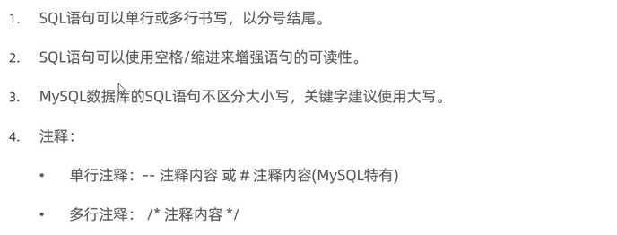


- SQL分类

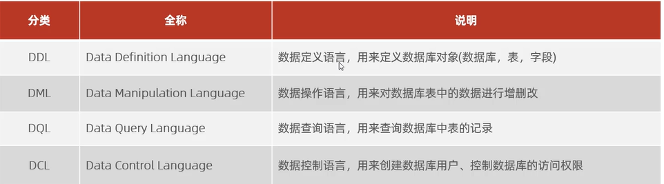


## DDL

### 数据库操作

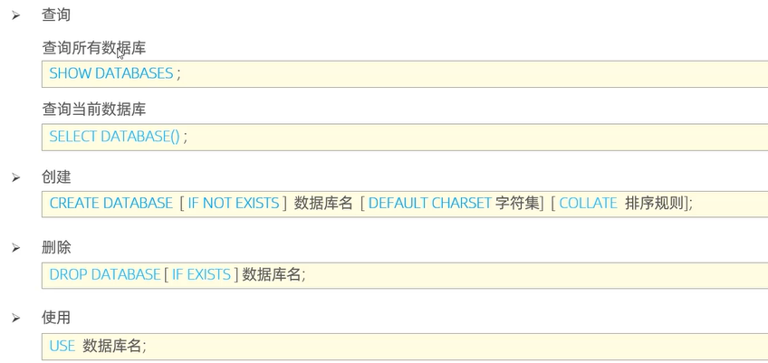


### 表操作

- 查询

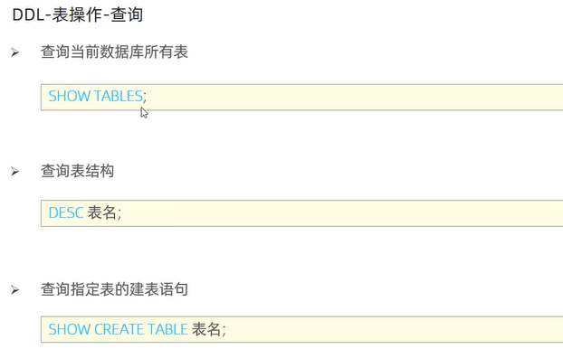


- 创建

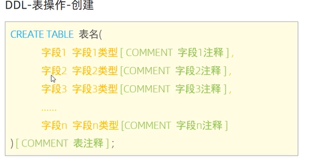

示例：

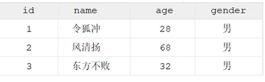

```sql
mysql> create table tb_user(
    -> id int comment '编号',
    -> name varchar(50) comment '姓名',
    -> age int comment '年龄',
    -> gender varchar(1) comment '性别'
    -> ) comment '用户表' ;
```


- 数据类型及案例

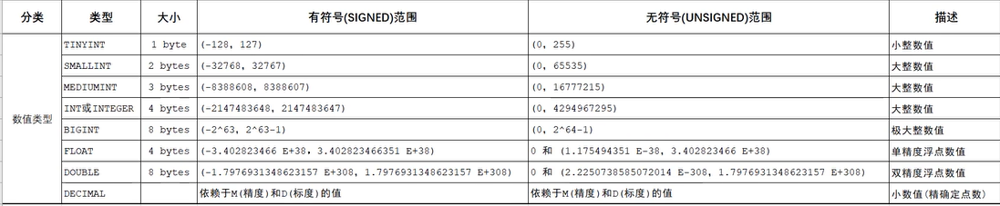

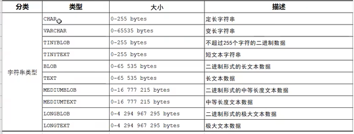

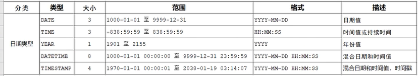


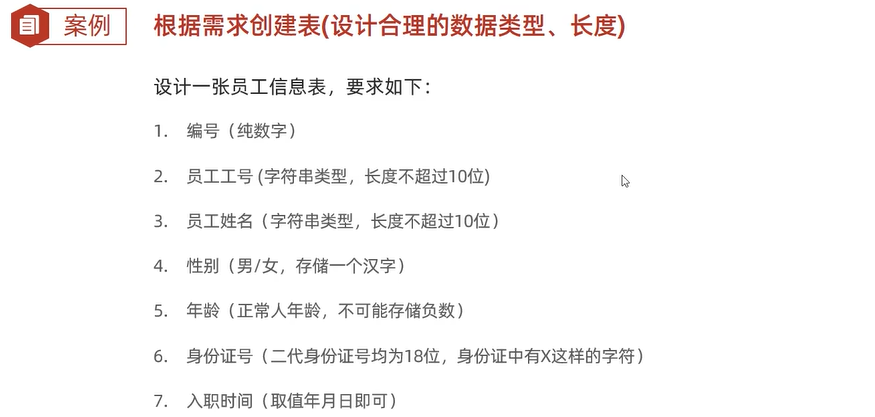

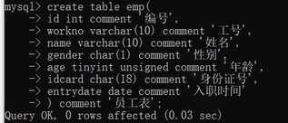


- 修改

1. 添加

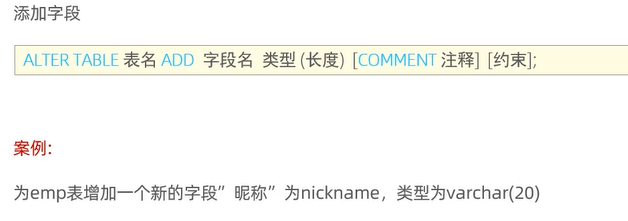

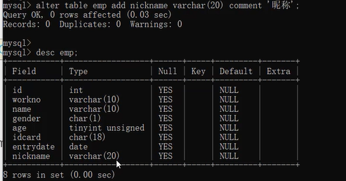


2. 修改

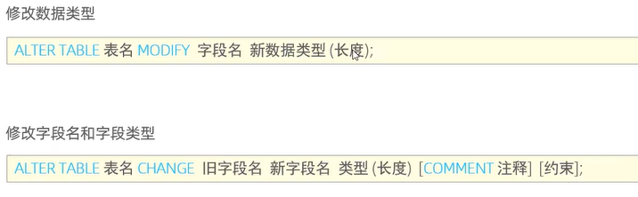


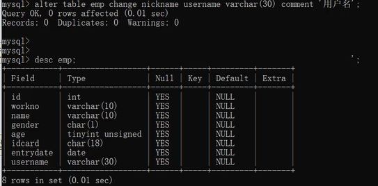


3. 删除

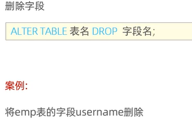

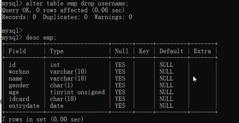


4. 修改表名

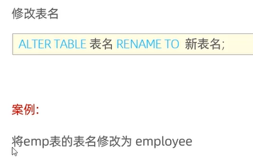

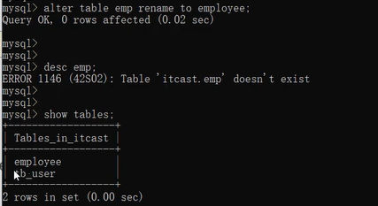


5. 删除表

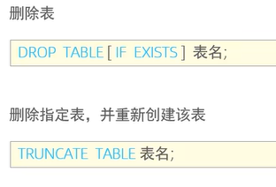

### DDL小结

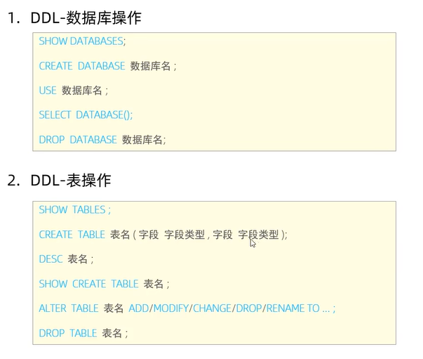


## DML

- 介绍


### 添加数据

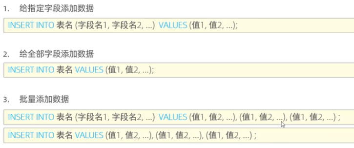

```sql
insert into tb_user(id, name, age, gender) values (1,'itcast',10,'男');

select * from tb_user;

insert into tb_user values (2,'itcast2',20,'女');

insert into tb_user values (3,'itcast3',9,'男'),(4,'itcast4',6,'女');
```


### 更新和删除数据

- 更新


```sql
update  tb_user set name='itheima' where id=1;

update tb_user set name='小昭',gender='女' where id=1;

update  tb_user set gender='女';
```


- 删除

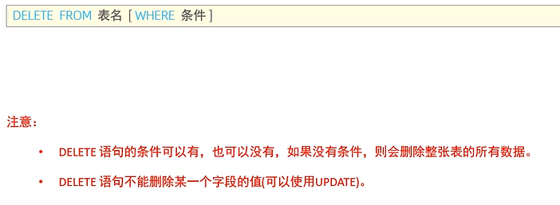

```sql
delete from tb_user where id=1;

delete from tb_user;
```


### 总结

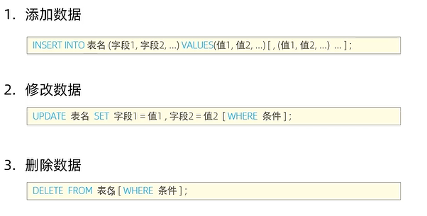


## DQL

- 介绍


### 基础查询

- 语法

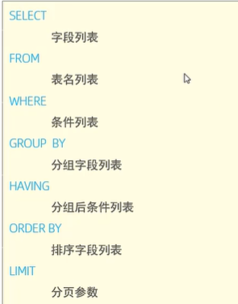


- 基本查询

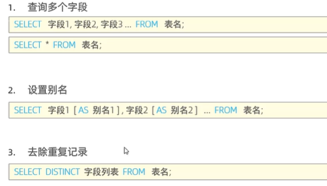

```sql
create table emp(
    id int comment '编号',
    workno varchar(10) comment '工号',
    name varchar(10) comment  '姓名',
    gender char(1) comment  '性别',
    age tinyint comment '年龄',
    idcard char(18) comment '身份证号',
    workaddress varchar(50) comment '工作地址',
    entrydate date comment '入职时间'
) comment '员工表';

insert into emp(id, workno, name, gender, age, idcard, workaddress, entrydate)
values (1,'1','柳岩','女',20,'123456789789456123','北京','2000-01-01'),
       (2,'2','张无忌','男',21,'123456789789456523','上海','2000-02-01'),
       (3,'3','韦一笑','男',22,'123456789789756123','江苏','2000-03-01'),
       (4,'4','赵敏','女',23,'123456789789456126','成都','2000-04-01'),
       (5,'5','小昭','女',24,'123456789789456121','天津','2000-05-01'),
       (6,'6','张三丰','男',25,NULL,'广州','2000-06-01');

-- 查询指定字段 name,workno,age返回
select name,workno,age from emp;

-- 查询所有字段返回
select id, workno, name, gender, age, idcard, workaddress, entrydate from emp;

select * from emp;

-- 查询所有员工地址

select emp.workaddress as '工作地址' from emp ;

-- 查询员工的工作地址（不要重复）
select distinct  emp.workaddress '工作地址' from emp;

```


### 条件查询

- 语法

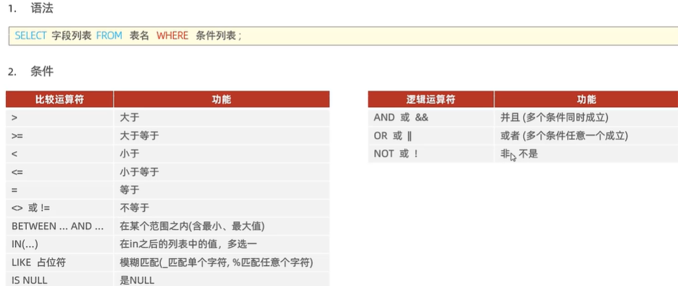

```sql

-- 条件查询
-- 1.查询年龄=23的员工
select * from emp where age=23;

-- 2.查询年龄小于23的员工信息
select * from emp where age<23;

-- 3.查询年龄小于等于23的员工
select * from emp where age<=23;

-- 4.查询没有身份证号的成员信息
select * from emp where idcard is null;

-- 5.查询有身份证号的员工信息
select * from emp where idcard is not null;

-- 6.查询年龄不等于23的成员信息
select * from emp where age!=23;

-- 7.查询年龄在21到24之间的员工信息
select * from emp where 21<=age && age<=24;

-- 8.查询性别为女且年龄小于23的员工信息
select * from emp where gender='女' and age<23;

-- 9.查询年龄等于21，22，24的员工信息
select * from emp where  age=21 or age=22 or age=24;

-- 10.查询性别为2个字的员工
select * from emp where name like '__';

-- 11.查询身份证最后一位是X的员工信息
select * from emp where idcard like '%X';
```


# 函数


# 约束


# 多表查询


# 事务

